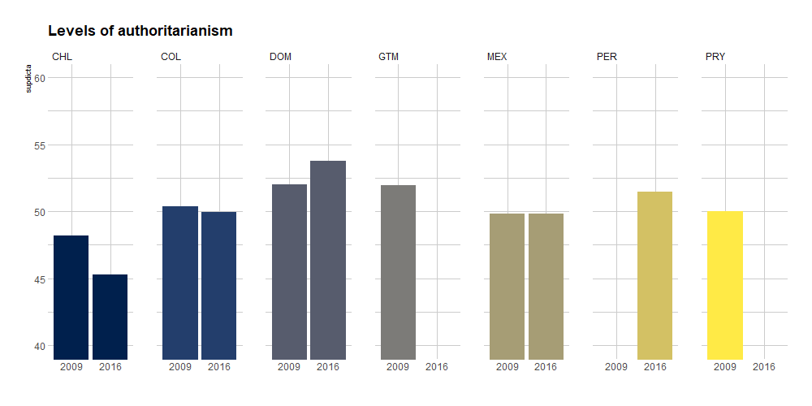
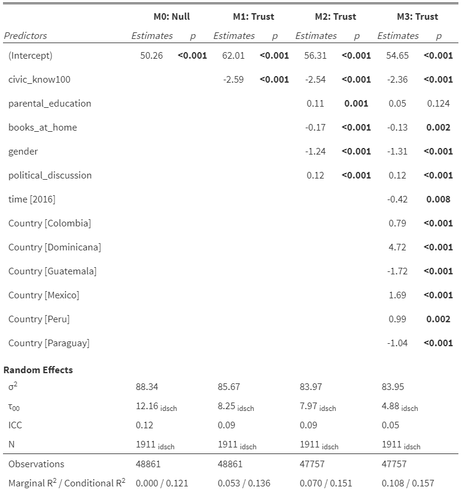

# Introduction

Institutional trust is a central aspect for the functioning of democracies as well as their legitimacy [@lipset1959; @uslaner2018; @zmerli2017]. Latin America has shown one of the lowest levels of trust worldwide [@catterberg2006], being commonly associated to the history of authoritarian governments and high levels of corruption [@bargsted2017]. Such scenario put at risk the legitimacy of democracy in Latin America, particularly at times of economic crises as the one currently faced as a consequence of the pandemic.

One of the aspects to take into account when evaluating both trust in institutions and authoritarian attitudes is the role of political knowledge. In an ideal sense, civic-political knowledge is considered as _the mother_ of trust [@galston2001; @galston2007], based on the simple assumption that it is certainly difficult to trust in something that you don't know. Considering that a significant deal of political system knowledge is (or should be) intentionally transmitted at the school level, it becomes relevant to ask about the extent to which the political knowledge acquired at a young age is associated to democratic attitudes, particularly institutional trust and authoritarianism in Latin America.

International studies that evaluate civic-political knowledge, the countries of the Americas tend to obtain lower levels of knowledge than developed countries [@schulz2018]. Additionally, civic-political knowledge has proven to play a rol on different areas of citizenship, such as institutional trust, participation, tolerance, authoritarian beliefs, among others [@castillo2014; @miranda2018; @sandoval-hernandez2019]. However, it is still not clear how political knowledge at school age could affect democratic attitudes in a region characterized by weak democratic foundations: Is a political knowledge at school age a predictor of more political trust and less authoritarianism in contexts where political institutions are weak and deligitimized as in Latin America? In the following we develop the main arguments and previous evidence on political trust and authoritarianism, as well as their link with political knowledge.

# Institutional trust

Institutional trust has a vast research agenda in the social sciences (see @zmerli2017), being generally understood as an evaluation that is made of civic and political institutions [@vandermeer2016]. This evaluation would be based on the performance of this institutions [@offe1999; @segovia2008] in a given context (Hardin, 2001). Thus, trust in political institutions such as parliament or political parties can be understood as the evaluation that citizens make of the functioning that they have in a given context.

Institutional trust levels can vary according to a series of contextual and individual characteristics. In the first group, aspects such as economic performance, wealth distribution or political change are considered [@martini2020; @citrin2018]. In the case of the individual level, several variables are considered such as genetics, personality, the perceived effectiveness of political and social institutions [@torney-purta2004], the awareness of corruptibility [@carrasco2019] and/or the perceived effectiveness of the institution [@lauglo2013]. Also, it has been linked to socio-economic characteristics. Here the educational level stands out, from which it is proposed that the more education the citizens have, the greater the abilities to evaluate the functioning of institutions [@lipset1960; @vandermeer2016].

As the context in which institutional trust development occurs is relevant for the acquisition of related attitudes, it is important to take into account the particularities of the democratic development in Latin America. The development of democratic institutions in the regions has suffered a series of contradictions, marked by an alternation between authoritarianism, democracy and semi-democracies [@bargsted2017]. Several countries had military dictatorships in the 1970s, with a large heterogeneity in the process of democratic recovery. Recent economic crisis and corruption scandals throughout Latin America have certainliy affected this process, observing low and declining levels of trust in different institutions, particularly the government and political parties [@latinobarometro2018].

## Authoritarianism

The concepto of authoritarianism, widely used in social psychology, basically consists of an ideological orientation to support strong authority and punish normative deviation [@altemeyer1996]. Three central dimensions of authoritarianism have been proposed [@duckitt2015]: authoritarian submission, which describes the degree of submission to the established authority; authoritarian aggression, which is understood as an aggressive attitude against groups or people sanctioned by authority (perception); and conventionalism, which describes the degree of adherence to conventions, traditions and social norms [@funke2005; @altemeyer1996].

Even though today most of the Latin American countries can be considered democratic, the political history has left scars in the political culture of the region. On the one hand, a relevant characteristic of Latin America is the interrupted democracies and political instability throughout the 20th century and so far in the 21th century, with the permanent threat of authoritarianism. Without going any further, in the last decade there have been serious democratic crises in Venezuela, Brazil, Peru, Bolivia, and Chile, just to mention the most prominent ones.

A high proportion of Latin American citizens consider that “in some circumstances an authoritarian government is preferable than a democratic one” (15%) or that “people like me do not care more about a democratic government than an authoritarian one” (28% ). Both non-democratic options add that 43% of people in Latin America do not decisively support democracy as the best form of Government [@latinobarometro2018] <<no entiendo esta suma>>. Studies in school-age population have also shown evidence of support to authoritarian practices [@schulz2018]. Therefor, it is possible to point out that the support for authoritarian practices has become part of the political culture in Latin America [@almond1989].

As authoritarianism is seen as a major threat to democracy [@dewey1989], countries have made various efforts to expand democratic ideals through citizen training from the school system [@cox2015]. In this sense, the assumption is that higher levels of political knowledge, improved through better citizenship education, should lead to less availability of authoritarian ideas [@schulz2018]. Nevertheless, the impact of citizenship education on lessening authoritarianism is still an under-researched area.

## The role of Civic Knowledge

Civic knowledge can be defined as the capacity (proficiency) of knowledge about various domains such as: civic-social systems, civic principles, partition <<?>> procedures and civic identities [@schulz2018]. This definition has great similarities with two concepts widely used in the political literature: _political knowledge_, referring to the information that citizens handle about the political system, and _political sophistication_, a more complex approach to expertise on political issues [@rapeli2013]. Beyond conceptual specificities, they all recognize the role that this type of knowledge plays in a better understanding of various relevant attitudes and behaviors in the democratic framework [@rapeli2013].

Regarding the link between civic knowledge and political attitudes such as institutional trust and authoritarianism, previous literature generally states that those with higher levels of knowledge will have a greater attachment to public life [@galston2001; @galston2007]. The literature systematically shows that people with higher levels of civic knowledge tend to engage politically differently than those with lower levels of knowledge [@rapeli2013]. For instance, they develop higher levels of political tolerance [@miranda2018], they present higher levels of political participation [@castillo2014; @castillo2015], have lower levels of authoritarianism [@sandoval-hernandez2019]. Thus, it is expected that higher levels of civic knowledge are associated with greater institutional trust (H1) and lower levels of self-righteousness <<??>>  (H2). However, comparative studies in the juvenile population show mixed evidence for H1. From the CIVED 1999, ICCS 2019 and ICCS 2016 study, it is possible to observe that in developed countries with low corruption rates, the association is positive, while in countries with less development and low high corruption, the association is negative [@sandoval-hernandez2019; @torney-purta2004]. In the case of Latin American countries, the prevailing interpretation is that higher levels of civic knowledge do not necessarily lead to more political trust, as political institutions are weaker than in other context, leading to a larger skepticism.
<<y authoritarianism?>>

# Methods

## Data

The data analyzed in this research corresponds to the International Civic and Citizenship Education Study. This study is carried out by the International Association for the Evaluation of educational achievement (IEA) and has been applied three times: CIVED 1999; ICCS 2009 and ICCS 2016. Its purpose is to investigate how educational systems prepare young people to assume their roles as citizens. The ICCS results have contributed to the debate about delivering civic and citizenship education in schools around the world. For this particular study we use data from ICCS 2009 and 2016 for seven Latin American countries: Chile, Colombia, the Dominican Republic, Mexico, Guatemala, Paraguay and Peru. The first four countries participated in the two waves, whereas Guatemala & Paraguay only in 2009 and Peru only in 2016.

The ICCS 2009-2016 Latin America dataset contemplates a nationally representative sample of 29,896 eighth grade students for 2009 and 25,319 for 2016. The selection of the students is made through a stratified random sampling in two stages. In the first stage a minimum of 150 schools per country was selected and at least one course per school was chosen randomly, including as participants all the students of that course [@schulz2011]. The sample sizes of students and schools for each country-year are summarized below:

Table 1. Distribution students ICCS per country/year

The International Civic and Citizenship Education Study (ICCS) includes a test of civic knowledge that assesses students' knowledge and citizen reasoning. At the same time, it also includes a questionnaire that measures students' perceptions, attitudes and background on issues related to citizenship, participation in school, school climate, among other variables. Finally, it consider a series of instruments to capture information from teachers, schools and educational systems [@schulz2011].

## b. Variables

_Dependent Variables_

The first dependent variable of this study is political trust index, evaluated in this chapter by four indicators that consider civic institutions of a political nature. Responses rated their trust level under the following categories: \textit {"completely", "quite", "a little", "not at all"}. The following table describes each ICCS indicator for 2009 and 2016:

Table 2. Trust in political institutions

The second dependent variable is support for authoritarianism. This scale is constructed from three indicators that identify the extent to which students support undemocratic practices. Where considered items that measure the concentration of power and justification of dictatorships for economic and order reasons. Students rated their level of agreement as _"strongly agree", "agree", "disagree", "strongly disagree"_ for each of these questions.

Table 3. Support for authoritarian practices

Both variables were estimated using confirmatory factor analyses which shows adequate fit indexes. Once estimated the measurement model, the latent measures were rescaled to mean 50 and standard deviation 10 for better interpretation.

_Independent Variables_

The main independent variable is the civic knowledge score achieved in the international ICCS test. The civic knowledge test consists of a set of 79 items that are applied organized in seven different formats, in which each student answers a booklet containing three subgroups of questions. To estimate the level of civic knowledge based on this design, an Item Response Theory (IRT) model is used to estimate five plausible values as a score. This variable presents an international average of 500 points and a standard deviation of 100. The scores for each of the countries in 2009 and 2016 are summarized below:

Table 4. Independent Variable: Civic Knowledge Score

The rest of the independent variables fulfill the objective of controlling the statistical association between support for authoritarianism, trust in political institutions and civic knowledge. In this sense, a *proxy* is used to assess the student's socio-economic and cultural background based on the highest educational level reached by the father or mother as well as by the number of books at home. Additionally, we included the student's gender and the level of political discussion that the student conducts with friends and family outside the classroom.

## Analytical Strategy

Firstly we present the differences across countries in 2009 and 2016 in both dependent variables (institutional trust and authoritarianism), using the specic items and the scales. Additionally, four multilevel regression models are estimated at the aggregate level to assess the association between civic knowledge and each described scales. Firts we estimate a null model (without predictors) which provide a decomposition of variance between schools whitin students allowing to interpret the percentage of variance atributed to school level (Intraclass Correlation - ICC). Second, we estimate a model adding the main predictor, civic knowledge. For a better understanding of regression coeficients we divide the scale in 100. The next model include the control variables for testing the stability of civic knowledge effect beyond socioeconomic individual variables. And the fouth model include the fixed effects of country and time, for testing the stability of civic knowledge between countries and time variation.

# Results

This section describes the main results of the study. First, we present a description for the levels of institutional trust and support for authoritarianism for each country in the study. Additionally, its presented a comparison of the scales between countries and time of the study. Secondly, the associations between the variables are explored descriptively. Finally, a set multilevel models its presented.

## Descriptive results

Figure 1 shows an item by item comparison of trust in olitical institutions between countries. Firts, it can be observed that the political parties receive the lowest levels of trust and Government recieve the highest trust in all observed countries while Parliament and Courts are in the mid level. Secondly, considering the general trend between countries it seems that Dominican Republic and Paraguay are the trusters countries while Peru and Guatemala are the distrusters. Thirdly, draw the attention the variability between institutions. For instance, in Guatemala and Peru the level of trust between institutions is closer than Paraguay or Colombia in where it can be observed higher distance between institutional trust. This indicate different ranges of trust across institutions.  Finally, in a general way, young people tend to show higher levels of trust in all the institutions evaluated when compared to adults survey results [@bargsted2017]. For instance, the 2018 Latinobarometer report that 21% of the respondents trust in the Parliament and 13% the political parties, all of them below or way below than the results from ICCS.

Figure 1. Institutional Trust in Latin América by country

Regarding to average level and temporal change (or stability) of trust between 2009 and 2016, there is some diversity between countries. On the one hand, Dominican Republic and Paraguay obtain the higher level of trust (above the scaled average = 50) while Mexico, Colombia, Peru, Guatemala and Chile present the lower level of trust (under the scaled average = 50). On the other hand, about the differences between 2009 and 2016, Guatemala maintain the level of trust, Mexico increse slightly the average and Colombia and particularly Chile decrease the levels of trust in this period.

Figure 2. Scale of Institutional Trust in Latin América by country/year

Figure 3 shows an item by item comparison of support for authoritarian practices between countries. First, it can be observed that the average levels for the three evaluated authoritarian practices are above the midpoint of the scale. In other words, there is high support for the concentration of power and dictatorships would be supported if this brings order, economic benefits and security. This aspect has been widely discussed as an alarm about the persistence of authoritarian beliefs in Latin America [@ schulz2018, @ sandoval-hernandez2019]. Second, considering the general pattern, the Dominican Republic, Guatemala and Peru show the greatest tendency towards authoritarianism, while Colombia, Mexico and Chile show the least. And third, regarding the dispersion between the three evaluated practices, the closeness between them is surprising. Only Guatemala and Colombia show some dispersion, but in most countries similar levels of support among the three forms of authoritarianism.

 

Figure 3. Support Authoritarianism in Latin América by country

Regarding to average level and temporal change (or stability) of authoritarianism between 2009 and 2016, there is some diversity between countries. On the one hand, Dominican Republic, Guatemala, Peru and Paraguay obtain the higher level of support for authoritarian practices (above the scaled average = 50), Mexico and Colombia are observed slightly above the average and Chile present the lower level of authoritarianism (under the scaled average = 50). On the other hand, about the differences between 2009 and 2016, Dominican Republic and Mexico increse the level, Colombia decrease mildly and Chile decrease clearly it average level in this period.

Figure  4. Scale of Support Authoritarianism in Latin América by country/year

Regarding the role that civic knowledge plays in supporting authoritarian practices and trust levels, we observe that at higher levels of civic knowledge the levels of support for authoritarian practices decrease (correlations between Peru=-0.246 and Dominican Republic=-0.331), whereas  trust levels also decrease (correlations between Chile=-0.133 and Paraguay=-0.400). Although these correlations are not uniform they go in the same direction in all countries. Young students who better comprehend the conceptual aspects of the political system tend to support in lesser extent the authoritarian practices of governments, since they seem to understand better that such practices are inconsistent with democratic life. However, those same young people better prepared in civic knowledge trust less in the institutions that compose the political system. Thus, greater civic knowledge improves one source of democratic legitimacy (less authoritarianism) but erodes another (less trust in institutions). Additionally, it is possible to observe that those who support authoritarian practices tend to trust more civic-political institutions, somewhat counterintuitive in light of the theoretical assumptions presented above.

Figure 5. Trust in civic institutions, Support for authoritarianism and Civic knowledge

## Regression models

The previous descriptive results depict a puzzling role of civic knowledge regarding trust in institutions and authoritarianism. In order to advance in the understanding of these associations, we estimated a series of multilevel regression models.

The first table 6 have institutional trust as dependent variable. In order to describe the variance decomposition of political trust, a null multilevel model was estimated, allowing for the description of the proportion of variance associated with school level. As can be observed, 17% of variance is associated with the school level. This proportion is slightly high considering previous evidence about attitudinal outcomes in educational studies. This means that a relevant part of the variance is linked to school characteristics. In Model 1 we observe that higher levels of civic knowledge are associated to lower levels of institutional trust. This means that, students who perform poorly on the knowledge test (for instance 300 points) obtain 55.64 points in average in political trust, whereas those with high performance (for instance 700 points) obtain 42.60 points, which is below the scale average. Model 2 enters a series of statistical controls. The result indicates that having more books at home and being a girl decreases institutional trust, while talking about social and political issues with family and friends would increase it. Finally, Model 3 enters the fixed effects of the country and year of the study (coded as dummy variables) to control for differences between countries and between year of study. The result shows that the observed effects remain rather similar controlled by country and year.

The second table 7 present four models for the scale of support for authoritarian practices as a dependent variable. In order to describe the variance decomposition of authoritarianism, a null multilevel model was estimated, allowing for the description of the proportion of variance associated with school level. As can be observed, 11% of variance is associated with the school level. This proportion is common for attitudinal variables considering previous evidence. This means that a small part of the variance is linked to school characteristics. Model 1, in this table, enters civic knowledge as the main predictor. The result indicates that at higher levels of civic knowledge, lower levels of support for authoritarian practices are observed. This translates into that young people who perform poorly on the knowledge test (for instance 300 points) obtain 55.56 points on the scale of support in authoritarian practices wich is a half of standard deviation above the scale average. In contrast, young people who obtain a high performance in the knowledge test (For instance 700 points) obtain in average 41.06 points on authoritarianism which this is closer to one standard deviation below the scale average. Model 2 enters a series of statistical controls. The result indicates that living in homes with more educated parents, having more books at home and being a girl decrease the support for authoritarian practices. Furthermore, it indicates that the effect of civic knowledge remains very stable even controlling for this set of variables. Finally, Model 3 enters the fixed effects of the country and year of the study (coded as dummy variables) to control for differences between countries and between year of study, with no remarkable changes to previous models.

\break

Table 6: Regression Models: Trust in civic institutions on Civic Knowledge in Latin América

 
\break

Table 7: Regression Models: Support Authoritarianism on Civic Knowledge in Latin América

# Discussion and conclusion

... pendiente

The present chapter was aimed at evaluating the effect of civic knowledge on two central aspects for democratic legitimacy in Latin American students: institutional trust and authoritarian attitudes. Regarding institutional trust, there are two main results to highlight. First, students show higher average institutional trust levels than the observed than in the adult population. This raises the question of whether these generations are more trusting than today's adults and/or if trust levels decrease when becoming adults. Secondly, certain consistencies are observed with the adult population. This is mainly that political institutions are the worst evaluated. In this regard, it is possible to ask whether some of the trust of young people is rooted in the trust levels of adult caregivers. Or to put it another way, to what extent is there an intergenerational socialization of institutional trust? And third, it is observed that Chile and Colombia show significant decreases in various institutions, while Mexico and the Dominican Republic remain and even increase in very few institutions. This raises the question of what could be the macro factors that can account for the temporal changes in the countries?

When considering the different authoritarian practices evaluated, most students tend to reject and/or support some of them consistently. On the one hand, statements associated with interruptions or violations of rights and freedom of expression by the authority receive the lowest support independent of year or participating country. On the contrary, statements regarding the exercise of authority receive greater support from young people. This shows that authoritarian beliefs are rooted above all in understanding ways of understanding authority. The level of stability of authoritarian attitudes is striking. With the exception of Chile, which shows significant decreases in most of the countries observed, young people maintain and even increase levels of self-imperialism, which again points in the direction of a deeply authoritarian culture in Latin America, on average.

Regarding the central question of the chapter, what is the role of civic knowledge to explain the levels of institutional trust and the levels of authoritarianism in young people in Latin America? Following the observed results, it is possible to affirm that having higher levels of civic knowledge has a paradoxical effect. On the one hand, and contrary to the political assumption, it negatively impacts trust levels. Knowing more makes young people more critical. Apparently, the irregular, interrupted and even failed institutional development character should be considered when thinking about the hypotheses. On the other hand, aligned with expectations, greater knowledge leads to lower levels of authoritarianism. Civic knowledge can function as a kind of inoculation under the influence of anti-democratic ideas such as authoritarian practices presented to students participating in the ICCS 2009 and 2016 study. Viewed in this way, civic knowledge decreases the availability of authoritarian ideas, but promotes or it makes possible the distrust in the institutions. In this sense, the typical demand of school systems for greater citizen training (broadly understood by greater delivery of knowledge) would not be able to solve all the ills. The problem is more complex and its solution too. So how would citizen training improve civic engagement? How would the school system take care of citizen training in contexts of irregular/failed institutional development?

A striking result is that young people with higher levels of authoritarianism tend to evaluate institutions more positively. This counterintuitive result requires to be observed in greater depth. On the one hand, as Altemeyer anticipates, the assessment of authority tends to show a correlation with those institutions that also represent authority. Support for authoritarian practices could easily be linked to the left-right continuum. In this association, people on the right tend to have higher levels of authoritarianism and people on the left less. Therefore, it is possible to think that the political position is playing a role in the evaluation of the institutions. These possible relationships are not cleared here, so the question remains about the behavior that authoritarian attitudes would have at the time of institutional evaluation in contexts of high and low knowledge.

\break

# References
